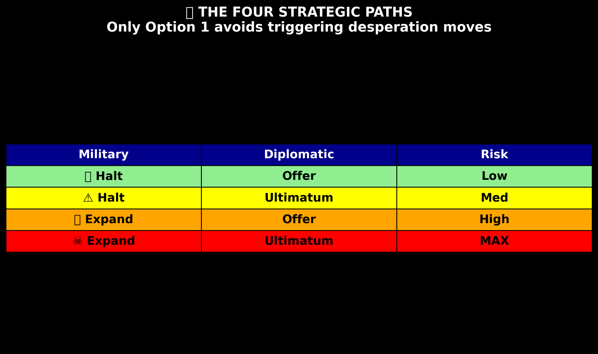
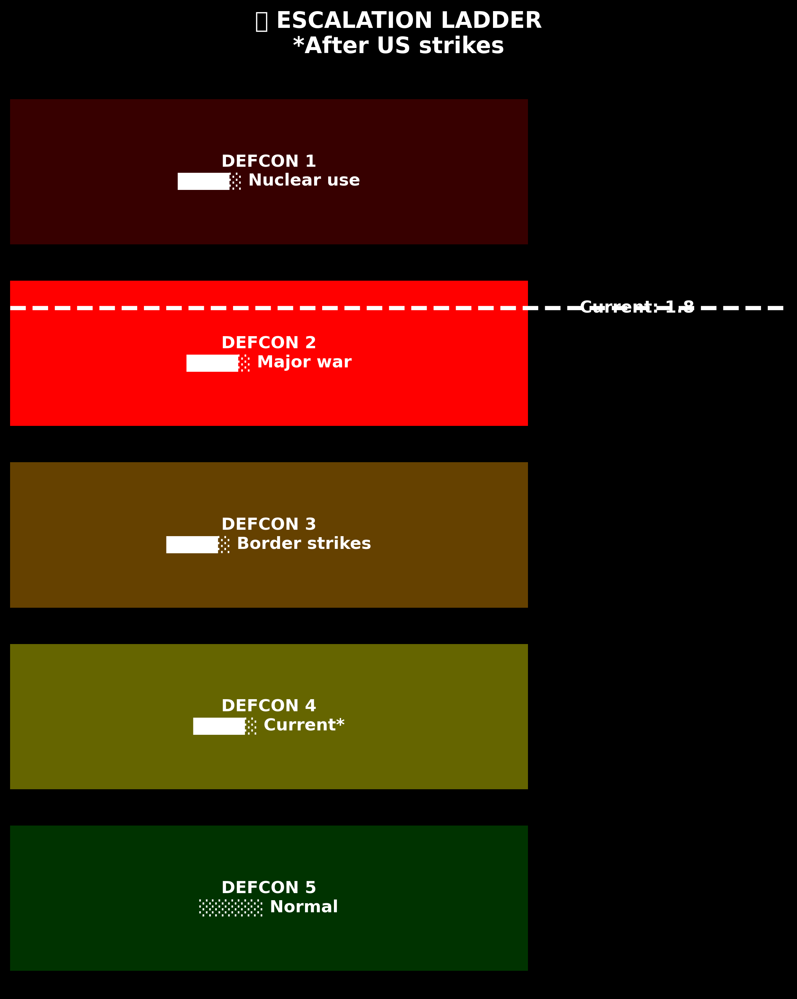
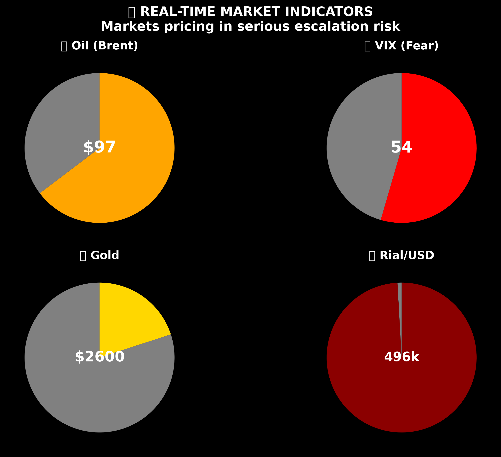
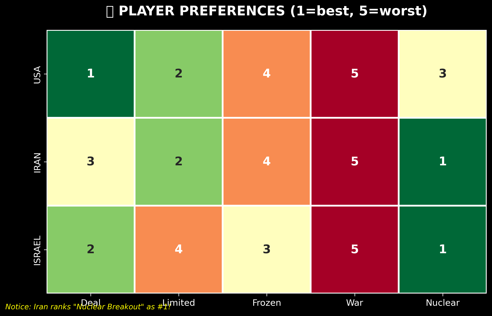
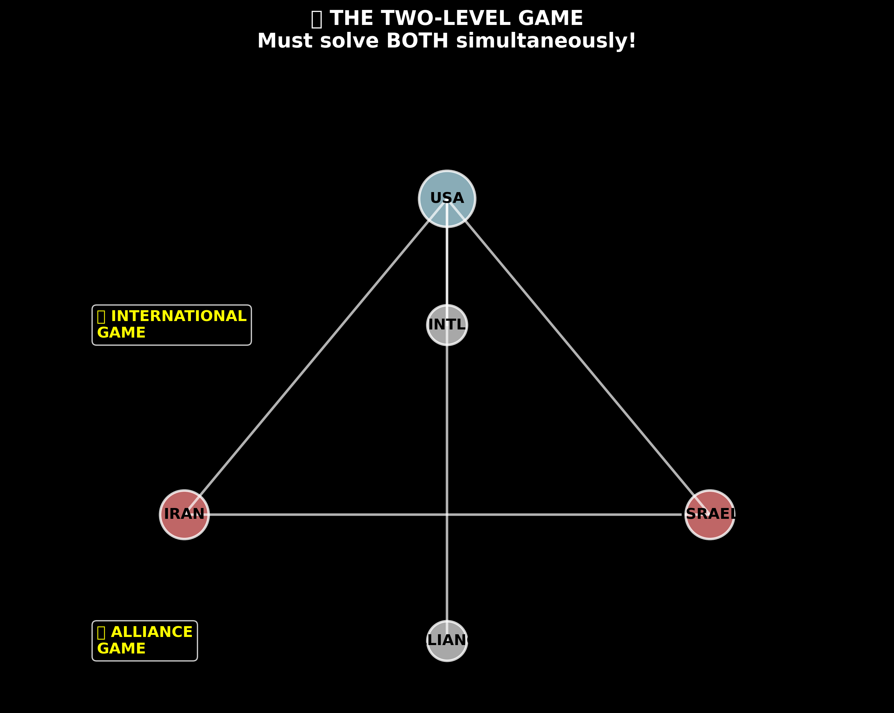

# 🧠 Strategic AI: Iran-Israel-US Game Theory Model

An advanced Bayesian game theory system with MCMC modeling, explainable AI, and real-time strategic analysis for understanding complex geopolitical interactions.



## 🎯 Overview

This project delivers a sophisticated AI-powered strategic analysis platform that combines:
- **🎲 MCMC Bayesian Modeling** - Probabilistic outcome prediction with uncertainty quantification
- **🧠 Explainable AI** - Interpretable decision-making with reasoning and confidence intervals  
- **📊 Interactive Visualizations** - Real-time analysis with beautiful cyberpunk-themed graphics
- **🔄 Dynamic Belief Updating** - Evidence integration with KL-divergence tracking
- **🎯 Robust Strategy Evaluation** - Minimax regret analysis under parameter uncertainty



## 🚀 Quick Start

### Prerequisites
- Python 3.11+
- [uv](https://github.com/astral-sh/uv) package manager

### Installation

```bash
# Clone the repository
git clone https://github.com/yourusername/game-theory-iran.git
cd game-theory-iran

# Install dependencies using uv
uv sync
```

### Running the Complete System

```bash
# Terminal 1: Start the MCMC API server
uv run python run_mcmc_server.py

# Terminal 2: Start the interactive web interface
uv run python run_d3_app.py

# Open your browser to http://localhost:8000
```

### Test the Integration

```bash
# Verify MCMC integration is working
uv run python test_mcmc_integration.py
```

### Quick Example

```bash
# Run a simple example to see the basic model
uv run python simple_example.py
```

## 📊 Model Architecture



### Core Components

1. **🎲 MCMC Bayesian Model** (`backend/models/mcmc_model.py`)
   - Hierarchical Bayesian framework with PyMC
   - Complex parameter interactions modeling
   - Full posterior distribution sampling

2. **🧠 Explainable AI Engine** (`frontend/static/js/explainable_ai.js`)
   - Interactive explanation interface
   - Real-time uncertainty visualization  
   - Evidence integration and reasoning display

3. **🔄 Bayesian Inference Engine** (`backend/models/bayesian_engine.py`)
   - Real-time belief updating with KL-divergence
   - Strategy optimization under uncertainty
   - Counterfactual scenario analysis

4. **🎯 Robust Game Theory Model** (`backend/models/robust_gametheory.py`)
   - Monte Carlo uncertainty quantification
   - Minimax regret analysis
   - Robustness scoring across parameter space



## 🎮 Key Features

### 🧠 Explainable AI Interface

The web application now features a sophisticated explainable AI system that provides:

- **📋 Strategic Recommendations** with confidence levels and detailed reasoning
- **🎯 Confidence Analysis** with uncertainty bounds and credible intervals  
- **📊 Uncertainty Quantification** showing prediction reliability
- **🔍 Factor Importance** analysis of key variables driving decisions
- **🎭 Scenario Robustness** testing across different conditions
- **🔬 Evidence Integration** with real-time belief updating



## 🎮 Usage Guide

### Basic Usage: Strategy Analysis

```python
from backend.models.mcmc_model import BayesianGameModel, GameState, Strategy
from backend.models.bayesian_engine import BayesianInferenceEngine

# Create the Bayesian model
model = BayesianGameModel()
engine = BayesianInferenceEngine(model)

# Define current game state
game_state = GameState(
    regime_cohesion=0.4,      # Iran's internal stability (0-1)
    economic_stress=0.9,      # Economic pressure (0-1)
    proxy_support=0.2,        # Proxy network strength (0-1)
    oil_price=97.0,          # Oil price (USD/barrel)
    external_support=0.3,     # China/Russia backing (0-1)
    nuclear_progress=0.7      # Nuclear advancement (0-1)
)

# Get strategy recommendation
recommendation = engine.recommend_strategy(game_state)

print(f"Recommended Strategy: {recommendation.recommended_strategy}")
print(f"Expected Utility: {recommendation.expected_utility:.3f}")
print(f"Certainty Level: {recommendation.certainty_level:.3f}")
print(f"Reasoning: {recommendation.reasoning}")
```

### Advanced Usage: Robust Analysis with Uncertainty

```python
from backend.models.robust_gametheory import RobustGameTheoryModel

# Create robust model
robust_model = RobustGameTheoryModel()

# Analyze strategy with uncertainty quantification
analysis = robust_model.analyze_strategy_robustly(
    strategy=Strategy.DETERRENCE_DIPLOMACY,
    base_game_state=game_state,
    n_samples=1000
)

# View results with credible intervals
print(f"Expected Utility: {analysis.expected_utility.mean:.3f} "
      f"({analysis.expected_utility.ci_lower:.3f}, "
      f"{analysis.expected_utility.ci_upper:.3f})")

print(f"Robustness Score: {analysis.robustness_score:.3f}")

# Outcome probabilities with uncertainty
for outcome in analysis.outcomes:
    print(f"{outcome.outcome.value}: "
          f"{outcome.probability.mean:.3f} "
          f"±{outcome.probability.std:.3f}")
```

### Scenario Analysis

```python
from backend.utils.monte_carlo import create_default_simulator

# Create simulator
simulator = create_default_simulator()

# Define scenarios
scenarios = {
    "regime_collapse": {
        "regime_cohesion": 0.1,
        "economic_stress": 0.95,
        "nuclear_progress": 0.8
    },
    "oil_shock": {
        "oil_price": 130,
        "economic_stress": 0.6,
        "external_support": 0.5
    },
    "nuclear_breakout_imminent": {
        "nuclear_progress": 0.95,
        "regime_cohesion": 0.2,
        "external_support": 0.1
    }
}

# Analyze scenarios
results = simulator.scenario_analysis(scenarios, n_samples_per_scenario=1000)

# Compare strategies across scenarios
for scenario_name, states in results.items():
    print(f"\nScenario: {scenario_name}")
    # Analyze each strategy in this scenario
```

### Real-time Belief Updating

```python
# Initial analysis
initial_recommendation = engine.recommend_strategy(game_state)

# New evidence arrives
evidence = {
    "regime_stability_signal": 0.25,  # Intelligence suggests regime weakening
    "nuclear_activity_detected": True,
    "proxy_attacks_increased": False
}

# Update beliefs
belief_update = engine.update_beliefs(evidence, evidence_reliability=0.85)

# Get updated recommendation
updated_recommendation = engine.recommend_strategy(game_state)

print(f"Belief change (KL divergence): {belief_update.kl_divergence:.3f}")
print(f"Strategy changed: {initial_recommendation.recommended_strategy != updated_recommendation.recommended_strategy}")
```

## 📈 Game Theory Model Details

### Players and Preferences

The model includes three primary strategic actors:

1. **USA (Trump Administration)**
   - Primary objective: Prevent Iranian nuclear weapon
   - Preferences: Deal > Limited Retaliation > Nuclear Breakout > Frozen Conflict > Full War

2. **Iran (Khamenei/Pezeshkian Regime)**
   - Primary objective: Regime survival
   - Preferences: Nuclear Breakout > Limited Retaliation > Deal > Frozen Conflict > Full War

3. **Israel (Netanyahu Government)**
   - Primary objective: Eliminate Iranian existential threat
   - Preferences: Nuclear Breakout > Deal > Frozen Conflict > Limited Retaliation > Full War

### US Strategic Options

1. **Deterrence + Diplomacy** (`DETERRENCE_DIPLOMACY`)
   - Military: Halt & Deter
   - Diplomatic: De-escalatory Off-Ramp

2. **Deterrence + Ultimatum** (`DETERRENCE_ULTIMATUM`)
   - Military: Halt & Deter
   - Diplomatic: Coercive Ultimatum

3. **Escalation + Diplomacy** (`ESCALATION_DIPLOMACY`)
   - Military: Expand Strikes
   - Diplomatic: De-escalatory Off-Ramp

4. **Escalation + Ultimatum** (`ESCALATION_ULTIMATUM`)
   - Military: Expand Strikes
   - Diplomatic: Coercive Ultimatum

### Possible Outcomes

- **Deal**: Negotiated settlement with verifiable constraints
- **Limited Retaliation**: Contained military response
- **Frozen Conflict**: Prolonged low-intensity standoff
- **Full War**: Regional military escalation
- **Nuclear Breakout**: Iran achieves nuclear weapons capability

### Key Variables

- **Regime Cohesion**: Iranian leadership unity (0=fractured, 1=unified)
- **Economic Stress**: Iranian economic distress from sanctions (0=stable, 1=crisis)
- **Proxy Support**: Effectiveness of Iran's regional proxies (0=collapsed, 1=strong)
- **Oil Price**: Brent crude price affecting global markets
- **External Support**: Material support from China/Russia (0=none, 1=full)
- **Nuclear Progress**: Iranian nuclear weapons capability (0=none, 1=weapon ready)

## 🔧 Advanced Configuration

### Model Parameters

Edit `backend/models/mcmc_model.py` to adjust prior beliefs:

```python
prior_beliefs = {
    "regime_stability": {"mean": 0.4, "std": 0.15},
    "economic_impact": {"mean": 0.8, "std": 0.1},
    "nuclear_threshold": {"mean": 0.75, "std": 0.2},
    "escalation_sensitivity": {"mean": 2.0, "std": 0.5}
}
```

### Sampling Configuration

Adjust MCMC sampling parameters:

```python
# In your analysis script
trace = model.sample_posterior(
    draws=2000,        # Number of posterior samples
    tune=1000,         # Number of tuning steps
    chains=4,          # Number of parallel chains
    target_accept=0.95 # Target acceptance rate
)
```

### Monte Carlo Configuration

```python
from backend.utils.monte_carlo import SamplingConfig

config = SamplingConfig(
    n_samples=10000,
    n_bootstrap=1000,
    confidence_level=0.95,
    sampling_method="lhs",  # Options: "random", "lhs", "sobol", "halton"
    antithetic=True        # Use variance reduction
)
```

## 📊 Visualization Features

The web interface provides two visualization modes:

### Clean Mode
- Professional, minimalist design
- Clear data presentation
- Publication-ready graphics

### Creative Mode (Default)
- Cyberpunk aesthetic with neon colors
- Particle effects and animations
- 3D visual elements
- Interactive hover effects

Toggle between modes in `frontend/static/js/main.js`:
```javascript
this.useCreativeMode = true; // Set to false for clean mode
```

## 🧪 Model Validation

Run comprehensive validation:

```python
from backend.utils.model_validation import ModelValidator

validator = ModelValidator(model)
results = validator.full_validation()

# Generate validation report
report = validator.generate_validation_report(results)
print(report)
```

Validation includes:
- Convergence diagnostics (R-hat, ESS)
- Posterior predictive checks
- Cross-validation (if historical data available)
- Calibration assessment
- Robustness testing

## 📚 API Reference

### GameState

```python
@dataclass
class GameState:
    regime_cohesion: float     # 0-1, Iran's internal stability
    economic_stress: float     # 0-1, Economic pressure level
    proxy_support: float       # 0-1, Proxy network strength
    oil_price: float          # USD per barrel
    external_support: float    # 0-1, China/Russia support
    nuclear_progress: float    # 0-1, Nuclear program advancement
```

### StrategyRecommendation

```python
@dataclass
class StrategyRecommendation:
    recommended_strategy: Strategy
    expected_utility: float
    utility_confidence_interval: Tuple[float, float]
    risk_assessment: Dict[str, float]
    alternative_strategies: List[Tuple[Strategy, float]]
    reasoning: str
    certainty_level: float
```

### UncertaintyBounds

```python
@dataclass
class UncertaintyBounds:
    mean: float
    std: float
    ci_lower: float      # 2.5th percentile
    ci_upper: float      # 97.5th percentile
    percentile_25: float
    percentile_75: float
```

## 🐳 Docker Deployment

```bash
# Build the Docker image
docker build -t game-theory-iran .

# Run the container
docker-compose up

# Access at http://localhost:8000
```

## 📖 Research Background

This model is based on game-theoretic analysis of the Iran-Israel-US strategic triangle, incorporating:

- **The Cornered Animal Paradox**: Iran's weakness paradoxically increases unpredictability
- **Perfect Bayesian Equilibrium**: Sequential decision-making under incomplete information
- **Risk dominance**: Accounting for miscalculation and inadvertent escalation
- **Two-level game theory**: Managing both adversary deterrence and ally restraint

Key finding: The optimal US strategy is "Halt & Deter + De-escalatory Off-Ramp", balancing deterrence with diplomatic options to avoid corner solutions that increase nuclear breakout risk.

## 🛠️ Development

### Project Structure

```
strategic-ai-game-theory/
├── backend/
│   ├── models/
│   │   ├── mcmc_model.py           # MCMC Bayesian model
│   │   ├── bayesian_engine.py      # Inference engine  
│   │   └── robust_gametheory.py    # Robust analysis
│   ├── utils/
│   │   ├── monte_carlo.py          # MC simulation
│   │   └── model_validation.py     # Validation framework
│   └── api/
│       └── mcmc_endpoints.py       # FastAPI MCMC server
├── frontend/
│   ├── static/
│   │   ├── js/
│   │   │   ├── main.js             # Main controller
│   │   │   ├── mcmc_integration.js # MCMC API integration
│   │   │   ├── explainable_ai.js   # Explainable AI interface
│   │   │   └── gametheory.js       # Base model
│   │   └── templates/
│   │       └── index.html          # Web interface
├── graphics/                       # Model visualizations
├── run_mcmc_server.py             # MCMC API server
├── run_d3_app.py                  # Main web app
├── test_mcmc_integration.py       # Integration tests
└── pyproject.toml                 # Dependencies
```

### Key Dependencies

- **MCMC/Bayesian**: pymc, arviz, pytensor
- **Visualization**: plotly, matplotlib, d3.js
- **Web Framework**: fastapi, streamlit
- **Scientific**: numpy, pandas, scipy

## 🤝 Contributing

1. Fork the repository
2. Create a feature branch (`git checkout -b feature/amazing-feature`)
3. Commit your changes (`git commit -m 'Add amazing feature'`)
4. Push to the branch (`git push origin feature/amazing-feature`)
5. Open a Pull Request

## 📄 License

This project is licensed under the MIT License - see the LICENSE file for details.

## 🙏 Acknowledgments

- Game theory framework inspired by Thomas Schelling's "Strategy of Conflict"
- Bayesian modeling approach based on Andrew Gelman's hierarchical modeling principles
- Visualization design influenced by D3.js best practices
- Research foundation from June 2025 strategic analysis

---

**Disclaimer**: This model is for academic and policy analysis purposes. Actual strategic decisions should incorporate additional information and expert judgment.