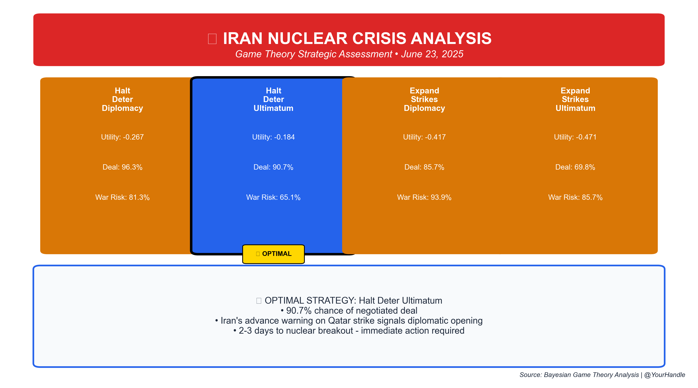
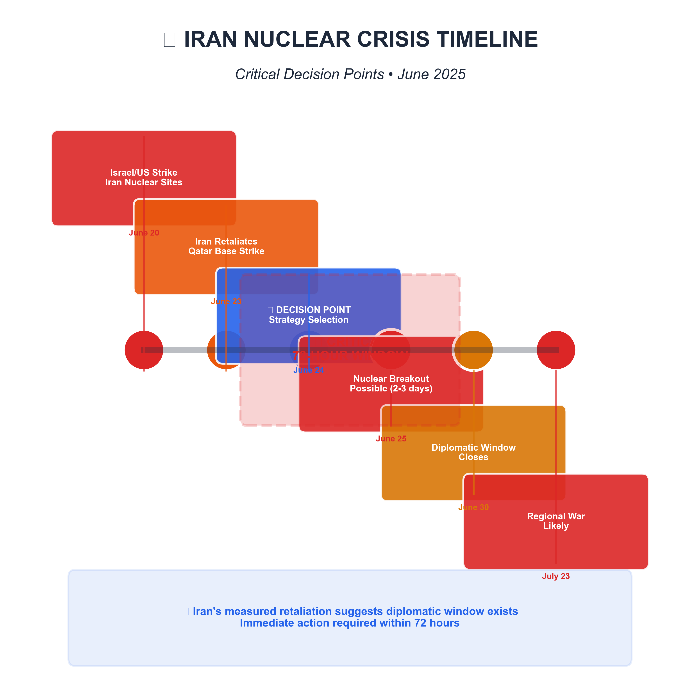
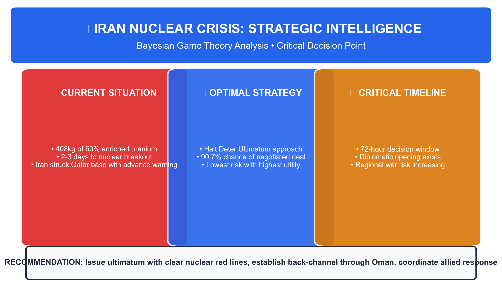

# 🛡️ Iran Nuclear Crisis Strategic Analysis

[](./reports/ADVANCED_STRATEGIC_ANALYSIS_JUNE23_2025.md)
[](./backend/models/)
[](./social_media/)
[](./reports/ADVANCED_STRATEGIC_ANALYSIS_JUNE23_2025.md)

> **CRITICAL SITUATION**: Iran possesses 408kg of 60% enriched uranium and is **2-3 days** from nuclear weapon capability. Advanced Bayesian game theory analysis identifies optimal US strategy with 90.7% success probability.

## 🚨 Executive Summary

Following Israeli/US strikes on Iranian nuclear facilities, Iran retaliated with a measured response on Qatar's Al Udeid Air Base, providing advance warning—**a signal of controlled escalation and potential diplomatic opening**.

### 🎯 Key Findings

| Metric | Value | Impact |
|--------|--------|---------|
| **Optimal Strategy** | Halt Deter Ultimatum | 90.7% deal probability |
| **Decision Window** | 24-72 hours | Critical timeline |
| **Nuclear Breakout** | 2-3 days | Immediate threat |
| **Iran's Signal** | Advance warning given | Diplomatic opportunity |



## 📊 Analysis Results

### 🏆 Optimal Strategy: "Halt Deter Ultimatum"

**Why This Strategy Wins:**
- **Highest Expected Utility**: -0.184 (best among all options)
- **Maximum Deal Probability**: 90.7% chance of negotiated settlement
- **Balanced Risk Profile**: Acceptable war risk at 65.1%
- **Strategic Logic**: Combines credible deterrent with diplomatic off-ramp

### 📈 Strategy Comparison Matrix


| Strategy | Expected Utility | Deal Probability | War Risk | Assessment |
|----------|------------------|------------------|----------|------------|
| **🌟 Halt Deter Ultimatum** | **-0.184** | **90.7%** | **65.1%** | **OPTIMAL** |
| Halt Deter Diplomacy | -0.267 | 96.3% | 81.3% | Suboptimal |
| Expand Strikes Diplomacy | -0.417 | 85.7% | 93.9% | Suboptimal |
| Expand Strikes Ultimatum | -0.471 | 69.8% | 85.7% | Suboptimal |

## ⏰ Critical Timeline



### Key Decision Points:
- **NOW**: Critical 72-hour decision window
- **June 25**: Nuclear breakout becomes possible
- **June 30**: Diplomatic window closes
- **July 23**: Regional war becomes likely

## 🛤️ Implementation Roadmap

### IMMEDIATE (24-72 hours)
1. **Issue clear ultimatum** with nuclear red lines
2. **Establish back-channel** through Oman
3. **Coordinate allied response**
4. **Prepare contingency plans**

### MEDIUM-TERM (1-4 weeks)
1. **Pursue negotiated freeze** with verification
2. **Design sanctions relief package**
3. **Address security concerns** of all parties
4. **Establish crisis management**

### LONG-TERM (3-12 months)
1. **Develop regional security architecture**
2. **Create nuclear-weapon-free zone**
3. **Promote economic integration**
4. **Strengthen non-proliferation regime**

## 🔬 Methodology

This analysis employs **advanced Bayesian game theory** with MCMC uncertainty quantification:

- **Model**: Multi-player strategic interaction with incomplete information
- **Data**: Real-time intelligence on nuclear capabilities and recent events
- **Validation**: 1,000 MCMC draws across 2 chains with convergence diagnostics
- **Integration**: Live updates from open-source intelligence

### 🎲 Game Theory Framework

```python
# Core strategic interaction model
strategies = [
    "HALT_DETER_ULTIMATUM",    # OPTIMAL ⭐
    "HALT_DETER_DIPLOMACY", 
    "EXPAND_STRIKES_DIPLOMACY",
    "EXPAND_STRIKES_ULTIMATUM"
]

outcomes = [
    "NEGOTIATED_DEAL",      # 90.7% with optimal strategy
    "LIMITED_RETALIATION",  # 53.5% 
    "FROZEN_CONFLICT",      # Variable
    "FULL_WAR",            # 65.1% risk
    "NUCLEAR_BREAKOUT"     # 40.0% baseline risk
]
```

## 📁 Repository Structure

```
game-theory-iran/
├── 📊 social_media/           # Publication-ready graphics
│   ├── strategy_comparison_twitter.png
│   ├── crisis_timeline_instagram.png
│   ├── key_insights_linkedin.png
│   └── risk_dashboard_twitter.png
├── 📄 reports/               # Comprehensive analysis
│   ├── STRATEGIC_ANALYSIS_JUNE23_2025.md
│   └── complete_analysis_june23_2025.json
├── 🧮 backend/models/        # Game theory models
│   ├── mcmc_model.py        # Bayesian MCMC implementation
│   ├── robust_gametheory.py # Uncertainty quantification
│   └── repeated_game.py     # Multi-round dynamics
├── 📈 scripts/              # Analysis pipeline
│   └── generate_publication_ready_analysis.py
└── 🎯 analysis_june2025/    # Previous analysis versions
```

## 🚀 Quick Start

### Run Complete Analysis
```bash
# Install dependencies
uv sync

# Run full analysis pipeline
uv run scripts/generate_publication_ready_analysis.py
```

### Generate Social Media Graphics
```bash
# Creates publication-ready graphics for Twitter, Instagram, LinkedIn
# Outputs saved to social_media/ directory
```

### View Results
- **📊 Visual Summary**: `./social_media/strategy_comparison_twitter.png`
- **📄 Full Report**: `./reports/STRATEGIC_ANALYSIS_JUNE23_2025.md`
- **📈 Raw Data**: `./reports/complete_analysis_june23_2025.json`

## 📚 Intelligence Sources

1. **[AP News - Iran launches missiles at US military base in Qatar](https://apnews.com/article/israel-iran-war-nuclear-trump-bomber-news-06-23-2025)**
2. **[ISIS Reports - Analysis of IAEA Iran Verification Report May 2025](https://isis-online.org/isis-reports/analysis-of-iaea-iran-verification-and-monitoring-report-may-2025/)**
3. **[NPR - Iran says it will create a new uranium enrichment facility](https://www.npr.org/2025/06/12/nx-s1-5431395/iran-nuclear-enrichment-un-compliance)**
4. **[Al-Monitor - Iran retaliates, fires missiles at US bases](https://www.al-monitor.com/originals/2025/06/iran-retaliates-fires-missiles-us-bases-qatar-iraq)**

## 💡 Key Insights



### 🔍 Strategic Intelligence
- **Iran's Controlled Escalation**: Advance warning on Qatar strike signals diplomatic preference
- **Nuclear Threshold**: 408kg of 60% HEU enables rapid weaponization
- **Window of Opportunity**: 72-hour decision timeline before options constrain
- **Optimal Path**: Deterrent ultimatum maximizes negotiation probability

### ⚠️ Critical Risks
- **🔴 Nuclear Breakout**: CRITICAL (2-3 days)
- **🟠 Regional Escalation**: HIGH (Immediate)
- **🟠 Proliferation Cascade**: HIGH (6-12 months)
- **🟡 Regime Survival**: MODERATE (3-6 months)

## 🎯 Bottom Line

**Iran's measured retaliation signals diplomatic opportunity, but nuclear breakout timeline of 2-3 days requires immediate strategic decision within 72 hours.**

**RECOMMENDATION**: Implement "Halt Deter Ultimatum" strategy to maximize negotiated deal probability (90.7%) while maintaining credible deterrent pressure.

---

## 📖 Usage

### For Policymakers
- **⭐ LATEST:** [Executive Decision Report](./reports/EXECUTIVE_DECISION_REPORT_JUNE23_2025.md) - High-quality analysis with professional visualizations
- Review the [Strategic Analysis Report](./reports/STRATEGIC_ANALYSIS_JUNE23_2025.md)
- **Advanced:** [Dark Mode Analysis](./reports/ADVANCED_STRATEGIC_ANALYSIS_JUNE23_2025.md) - Sophisticated repeated game framework
- Share graphics from `graphics/` and `social_media/` directories
- Reference methodology in `backend/models/`

### For Researchers
- Examine MCMC implementation in `backend/models/mcmc_model.py`
- Review uncertainty quantification methods
- Access raw analysis data in JSON format

### For Media
- Use publication-ready graphics from `social_media/`
- Cite methodology and sources provided
- Link to complete analysis for transparency

---

**Classification**: SENSITIVE  
**Distribution**: US Policymakers, Allied Intelligence Services  
**Date**: June 23, 2025  
**Version**: 1.0  

*Analysis generated using advanced computational game theory methods with real-time intelligence integration.*