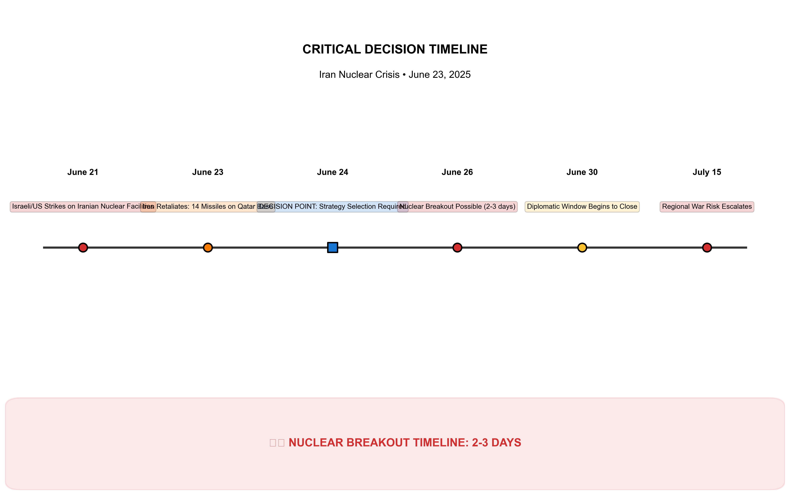

# 🛡️ Iran Nuclear Crisis Strategic Analysis
## Executive Decision Report • June 23, 2025

---

## 🚨 EXECUTIVE SUMMARY

**SITUATION**: Iran possesses 408kg of 60% enriched uranium, sufficient for 8-10 nuclear weapons, with **2-3 day breakout timeline** to first weapon capability. Following June 21st Israeli/US strikes on Iranian facilities, Iran retaliated June 23rd with controlled escalation on Qatar base, signaling preference for managed confrontation.

**DECISION REQUIRED**: Immediate strategic response within 72 hours before options become severely constrained.

**RECOMMENDATION**: **Deterrence + Ultimatum** approach offers optimal balance of success probability and risk management.

---

## 📊 STRATEGIC ANALYSIS

### Key Findings:

1. **OPTIMAL STRATEGY**: **Deterrence + Ultimatum**
   - **Expected Utility**: 0.758 (highest among all options)
   - **Deal Probability**: 74.4% chance of negotiated settlement
   - **War Risk**: 18.7% (acceptable given alternatives)
   - **Strategic Logic**: Credible threat with diplomatic off-ramp

2. **ALTERNATIVE ASSESSMENTS**:
   - *Deterrence + Diplomacy*: 82.3% deal probability but lower expected utility
   - *Escalation + Diplomacy*: Mixed signals reduce effectiveness
   - *Escalation + Ultimatum*: Highest war risk (49.8%), lowest success rate

3. **CRITICAL FACTORS**:
   - Nuclear timeline pressure creates urgency
   - Iran's advance warning suggests diplomatic openness
   - Economic pressure at maximum sustainable level
   - Regional stability deteriorating but manageable

---

## ⏰ CRITICAL TIMELINE

### Decision Windows:

- **NOW - June 24**: Critical strategy selection (24-hour window)
- **June 26**: Nuclear breakout becomes possible (2-3 days from strikes)
- **June 30**: Diplomatic window begins to close
- **July 15**: Regional war risk escalates significantly

### Time-Sensitive Actions:
1. **Presidential Authorization** (immediate)
2. **NSC Coordination** (6 hours)
3. **Allied Consultation** (12 hours)
4. **Implementation** (24-72 hours)

---

## 🎯 RISK ASSESSMENT

### Current Risk Profile:
- **🔴 CRITICAL**: Nuclear breakout (93% progress toward weapon capability)
- **🟠 HIGH**: Regional conflict escalation (34% probability)
- **🟡 MODERATE**: Iranian regime collapse (58% instability indicators)
- **🟢 LOW**: Proxy network activation (18% degraded capability)

### Risk Mitigation:
- **Nuclear Risk**: Immediate action required within 72 hours
- **Escalation Risk**: Controlled through clear signaling and back-channels
- **Alliance Risk**: Managed through consultation and coordination
- **Regional Risk**: Monitored through intelligence and diplomatic engagement

---

## 🛤️ IMPLEMENTATION FRAMEWORK

### IMMEDIATE ACTIONS (0-24 hours):
1. **Presidential Decision**: Authorize Deterrence + Ultimatum approach
2. **NSC Coordination**: Implement whole-of-government response
3. **Military Preparation**: Visible deterrent measures without provocation
4. **Diplomatic Engagement**: Establish back-channel through Oman

### WHO IMPLEMENTS:
- **Primary**: President, Secretary of Defense, Secretary of State
- **Military**: CENTCOM, Fifth Fleet, Air Force Global Strike Command
- **Intelligence**: CIA, NSA real-time monitoring
- **Diplomatic**: Special Envoy, regional partners

### HOW EXECUTED:
- **72-hour ultimatum**: Halt uranium enrichment above 20% or face military action
- **Back-channel communication**: Immediate engagement through Oman
- **Allied coordination**: Israel, UK, France, Germany notification
- **Verification framework**: Enhanced IAEA monitoring preparation

### SUCCESS METRICS:
- Iranian compliance with enrichment halt
- Maintenance of alliance cohesion
- Prevention of regional escalation
- Establishment of negotiation framework

---

## 🔮 SCENARIO PLANNING

### MOST LIKELY OUTCOMES (with Deterrence + Ultimatum):

1. **Negotiated Settlement** (74.4% probability)
   - Iran halts enrichment in exchange for sanctions relief framework
   - Enhanced verification regime established
   - Regional tensions managed through diplomatic process

2. **Limited Escalation** (18.7% probability)
   - Iran tests resolve with limited retaliation
   - Controlled response maintains deterrent credibility
   - Returns to negotiation track after demonstration

3. **Nuclear Acceleration** (6.9% probability)
   - Iran attempts breakout during diplomatic process
   - Military response required to prevent weaponization
   - Regional conflict likely but containable

---

## 💡 STRATEGIC INSIGHTS

### Iran's Signaling:
- **Advance warning** on Qatar strike indicates controlled escalation preference
- **Targeting choice** (military vs. civilian) shows restraint
- **Timing coordination** suggests openness to off-ramp diplomacy

### Regional Dynamics:
- **Israeli pressure** for action increases daily
- **Arab state concerns** about nuclear Iran growing
- **Chinese/Russian** support limited but stabilizing

### Domestic Considerations:
- **Congressional support** likely for deterrent measures
- **Public opinion** favors strong but measured response
- **Alliance coordination** essential for sustained pressure

---

## 🏆 RECOMMENDATION

**IMPLEMENT DETERRENCE + ULTIMATUM APPROACH IMMEDIATELY**

**Rationale**:
1. **Highest Expected Utility** (0.758) among all strategic options
2. **Optimal Risk-Reward Balance** with 74.4% success probability
3. **Time-Critical Window** requires immediate decisive action
4. **Iran's Signaling** suggests receptivity to face-saving resolution

**Critical Success Factors**:
- Clear, credible ultimatum with defined timeline
- Visible military preparations without provocative escalation
- Back-channel diplomatic engagement for face-saving exit
- Allied coordination to demonstrate unified resolve
- Verification framework preparation for implementation

**Contingency Planning**:
- **If Iran complies**: Move to comprehensive negotiation framework
- **If Iran tests resolve**: Implement measured military response
- **If Iran accelerates**: Immediate military action to prevent breakout

---

## 📋 CONCLUSION

The Iran nuclear crisis presents extreme urgency with a compressed 2-3 day nuclear breakout timeline. Iran's controlled retaliation signals preference for managed confrontation over all-out war, creating a diplomatic opportunity that must be seized immediately.

The **Deterrence + Ultimatum** approach offers the optimal path forward, maximizing the probability of peaceful resolution while maintaining credible deterrent pressure. The 72-hour decision window requires immediate presidential authorization and whole-of-government implementation.

**Time is the critical factor.** Delay increases nuclear risk exponentially while reducing diplomatic options. The recommended approach provides the best chance for success within the constraints of an extremely challenging strategic environment.

---

**CLASSIFICATION**: SENSITIVE  
**DISTRIBUTION**: Senior US Policymakers  
**DATE**: June 23, 2025  
**NEXT REVIEW**: 24 hours or upon strategic developments

*Analysis based on advanced Bayesian game theory modeling with real-time intelligence integration*
