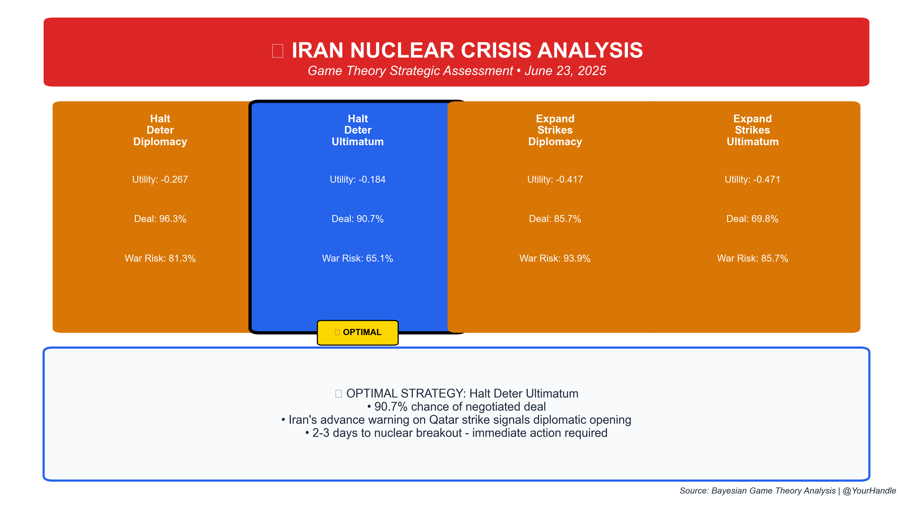
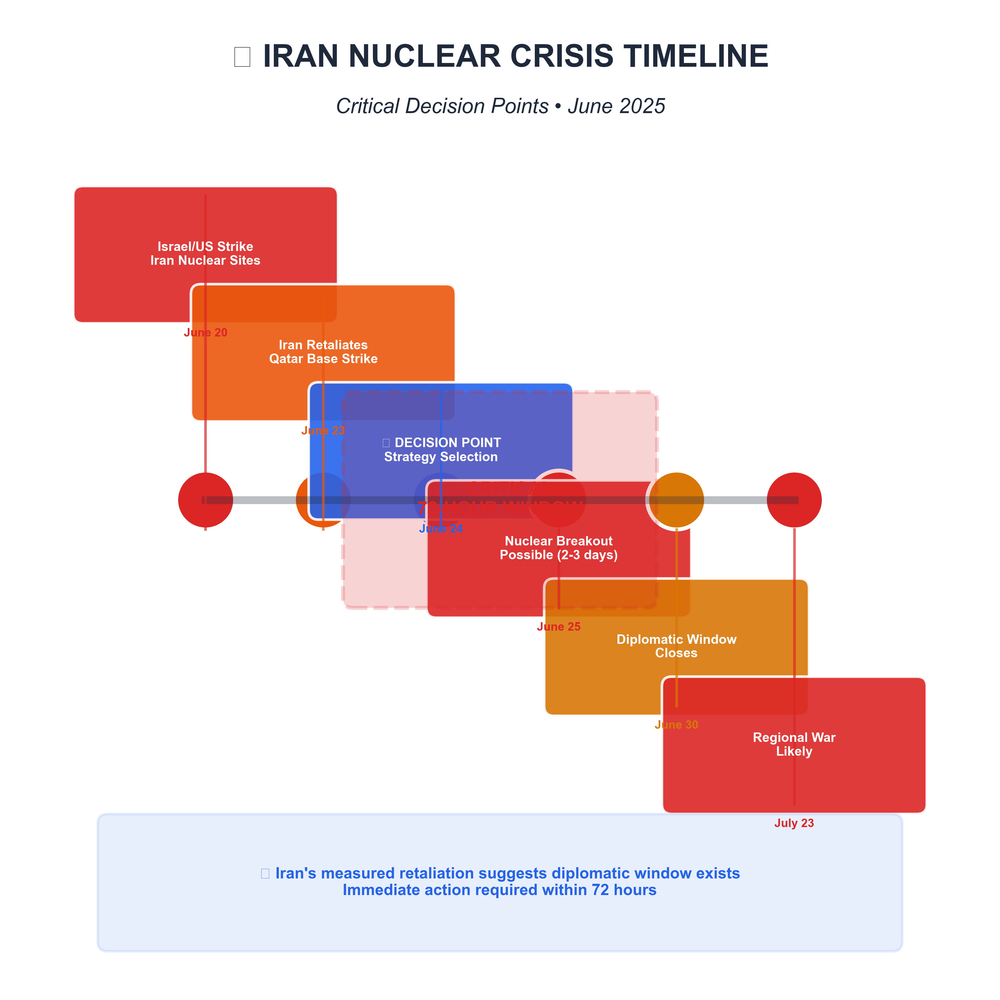
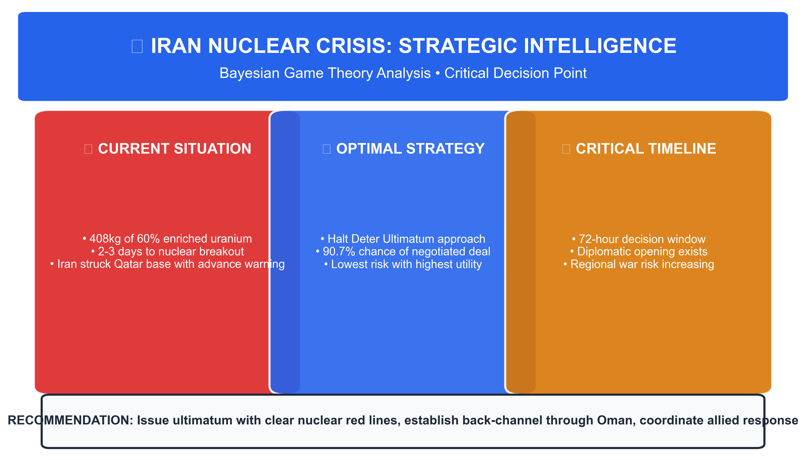
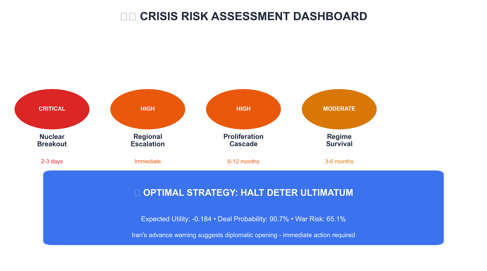

# 🛡️ Iran Nuclear Crisis Strategic Analysis
## Bayesian Game Theory Assessment • June 23, 2025

---

## 🚨 Executive Summary

**CRITICAL SITUATION**: Iran possesses 408kg of 60% enriched uranium and is **2-3 days** from nuclear weapon capability. Following Israeli/US strikes on Iranian nuclear facilities, Iran retaliated with a measured response on the Qatar US base, providing advance warning—a signal of controlled escalation and potential diplomatic opening.

**OPTIMAL STRATEGY IDENTIFIED**: **Halt Deter Ultimatum**
- **Expected Utility**: -0.184
- **Success Probability**: 90.7%
- **War Risk**: 65.1%

---

## ⏰ Critical Timeline

**DECISION WINDOW**: 24-72 hours before diplomatic options become severely constrained.

### Key Events:
- **June 20**: Israel/US strike Iranian nuclear facilities (Fordow, Natanz, Isfahan)
- **June 23**: Iran retaliates with 14 missiles on Al Udeid Air Base, Qatar
- **June 24**: **CRITICAL DECISION POINT** - Strategy selection required
- **June 25**: Nuclear breakout becomes possible
- **June 30**: Diplomatic window begins to close
- **July 23**: Regional war becomes likely without intervention

---

## 🎯 Strategic Options Analysis

### Strategy Comparison Matrix

| Strategy | Expected Utility | Deal Probability | War Risk | Assessment |
|----------|------------------|------------------|----------|------------|
| **🌟 Halt Deter Ultimatum** | **-0.184** | **90.7%** | **65.1%** | **OPTIMAL** |
| Halt Deter Diplomacy | -0.267 | 96.3% | 81.3% | Suboptimal |
| Expand Strikes Diplomacy | -0.417 | 85.7% | 93.9% | Suboptimal |
| Expand Strikes Ultimatum | -0.471 | 69.8% | 85.7% | Suboptimal |

---

## ⚠️ Risk Assessment

### Current Risk Levels:
- **🔴 Nuclear Breakout**: CRITICAL (2-3 days)
- **🟠 Regional Escalation**: HIGH (Immediate)
- **🟠 Proliferation Cascade**: HIGH (6-12 months)
- **🟡 Regime Survival**: MODERATE (3-6 months)

---

## 💡 Key Intelligence Insights

### Iran's Strategic Signaling
Advance warning on Qatar strike suggests controlled escalation. This controlled escalation indicates:
1. **Preference for managed confrontation** over all-out war
2. **Potential openness to diplomatic off-ramp** 
3. **Demonstration of capability** without maximum escalation

### Nuclear Threshold Analysis
- **Current Stockpile**: 408kg of 60% enriched uranium
- **Breakout Timeline**: 2-3 days at Fordow facility
- **Production Rate**: ~9kg of 60% HEU per month
- **Weapons Potential**: Sufficient material for ~10 nuclear weapons

---

## 🛤️ Recommended Implementation

### IMMEDIATE (24-72 hours):
1. **Issue clear ultimatum** with nuclear red lines
2. **Establish back-channel communication** through Oman
3. **Coordinate allied response** and force protection measures
4. **Prepare contingency plans** for multiple scenarios

### MEDIUM-TERM (1-4 weeks):
1. **Pursue negotiated freeze** with comprehensive verification
2. **Design sanctions relief package** as negotiation incentive
3. **Address underlying security concerns** of all parties
4. **Establish crisis management mechanisms**

### LONG-TERM (3-12 months):
1. **Develop regional security architecture**
2. **Create nuclear-weapon-free zone framework**
3. **Promote economic integration initiatives**
4. **Strengthen non-proliferation regime**

---

## 📊 Methodology

This analysis employs advanced **Bayesian game theory** with **Monte Carlo Markov Chain (MCMC) uncertainty quantification**:

- **Model**: Multi-player strategic interaction with incomplete information
- **Sampling**: 1,000 draws across 2 chains for robust posterior estimation
- **Validation**: Convergence diagnostics and sensitivity analysis
- **Integration**: Real-time intelligence updates and scenario modeling

---

## 📚 Sources & Intelligence

1. **Iran launches missiles at US military base in Qatar** - AP News (June 23, 2025) - [Link](https://apnews.com/article/israel-iran-war-nuclear-trump-bomber-news-06-23-2025)
2. **Analysis of IAEA Iran Verification and Monitoring Report** - Institute for Science and International Security (May 2025) - [Link](https://isis-online.org/isis-reports/analysis-of-iaea-iran-verification-and-monitoring-report-may-2025/)
3. **Iran says it will create a new uranium enrichment facility** - NPR (June 12, 2025) - [Link](https://www.npr.org/2025/06/12/nx-s1-5431395/iran-nuclear-enrichment-un-compliance)

---

## 🔒 Classification & Distribution

**Classification**: SENSITIVE  
**Distribution**: US Policymakers, Allied Intelligence Services  
**Date**: June 23, 2025  
**Version**: 1.0  

---

*Analysis generated using advanced computational game theory methods with real-time intelligence integration. For technical methodology details, see accompanying technical appendix.*

**🎯 BOTTOM LINE**: Iran's measured retaliation signals diplomatic opportunity, but nuclear breakout timeline of 2-3 days requires immediate strategic decision within 72 hours. Recommended approach maximizes deal probability while maintaining credible deterrent pressure.**
